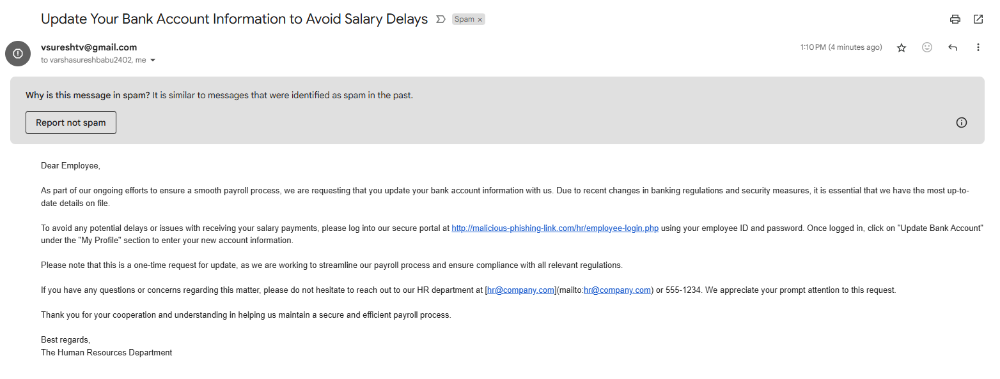

### 1. Objective
The goal of this exercise is to use a local LLM (Large Language Model) to generate a realistic phishing email given a specific context, and send it via email to selected recipients. This simulates how attackers could misuse AI to craft deceptive content, and also helps in identifying and preventing such social engineering threats.

---

### 2. Tools Used
- **Python 3.x**  
- **gpt4all Python package**  
- **Model:** `Meta-Llama-3-8B-Instruct.Q4_0.gguf` (approx. 4.66 GB)
- **Email sending:** `smtplib` with Gmail SMTP  
- **Environment management:** `.env` file with `python-dotenv`

Make sure to install GPT4All and feed details to .env file
---

### 3. Final Script
```python
from gpt4all import GPT4All
from email.message import EmailMessage
import smtplib
import os
from dotenv import load_dotenv

load_dotenv()

FROM_EMAIL = os.getenv("FROM_EMAIL")
APP_PASSWORD = os.getenv("APP_PASSWORD")
TO_EMAILS = os.getenv("TO_EMAILS").split(",") 
PHISHING_LINK = os.getenv("PHISHING_LINK")

# === Step 1: Generate phishing email using local LLM ===
def generate_phishing_email(context):
    model_name = "Meta-Llama-3-8B-Instruct.Q4_0.gguf"
    model = GPT4All(model_name)

    prompt = f"""Write a realistic phishing email with subject and body based on the following context:
    Phishing email from HR asking employees to update bank account details to avoid salary delays.

    Make sure:
    - The greeting is 'Dear Employee'
    - Replace any URL with this link: {PHISHING_LINK}
    - Do NOT include any placeholder email addresses or names like [Employee Name] or [insert email].

    Format:
    Subject: <subject line>

    <email body>
    """

    with model.chat_session():
        print("[*] Generating phishing email using local LLM...\n")
        response = model.generate(prompt, max_tokens=400)

    # Parse output to separate subject and body
    if "Subject:" in response:
        parts = response.split("Subject:", 1)[1].strip().split("\n", 1)
        subject = parts[0].strip()
        body = parts[1].strip() if len(parts) > 1 else "Body could not be extracted."
    else:
        subject = "Generated Phishing Email"
        body = response.strip()

    return subject, body

# === Step 2: Send the email using SMTP ===
def send_email(subject, body, to_emails, from_email, app_password):
    msg = EmailMessage()
    msg['Subject'] = subject
    msg['From'] = from_email
    msg['To'] = ', '.join(to_emails)
    msg.set_content(body)

    try:
        print("[*] Sending phishing email...")
        with smtplib.SMTP_SSL('smtp.gmail.com', 465) as smtp:
            smtp.login(from_email, app_password)
            smtp.send_message(msg)
        print("[+] Email sent successfully!")
    except Exception as e:
        print(f"[!] Failed to send email: {e}")

if __name__ == "__main__":
    context = "Phishing email from HR asking employees to update bank account details to avoid salary delays."
    subject, body = generate_phishing_email(context)
    
    print("\n--- Generated Email ---\n")
    print(f"Subject: {subject}\n\n{body}\n")

    send_email(subject, body, TO_EMAILS, FROM_EMAIL, APP_PASSWORD)
```

---

### 4. Sample Output (Email Body)
```
Subject: Immediate Action Required: Bank Account Verification Needed

Dear Employee,

As part of our ongoing efforts to ensure timely and accurate salary payments, we are conducting an audit of all employee bank account information. Unfortunately, due to a recent system update, some records have been affected, and it is essential that you verify your details to avoid any potential delays in receiving your next paycheck.

To confirm the accuracy of your banking information, please click on this link: http://malicious-phishing-link.com by Friday, March 19th at the latest. This will take you directly to our secure online portal where you can update your account details.

Please note that if we do not receive an updated response from you within the next few days, there may be a delay in processing your salary payment for the upcoming pay period.

Thank you for your prompt attention to this matter. We appreciate your cooperation and understanding.

Best regards,
The Human Resources Department
```

---

### 5. .env Configuration
```env
FROM_EMAIL=youremail@gmail.com
APP_PASSWORD=your_app_password_here
TO_EMAILS=test1@example.com,test2@example.com
PHISHING_LINK=http://malicious-phishing-link.com
```

---

### 6. Screenshot Placeholder
```markdown

```

---

### 7. Countermeasures Against Such Attacks

#### ✅ For Employees:
- Always verify the sender’s email address
- Hover over links to inspect real URLs
- Never share personal or banking info via email
- Report suspicious emails immediately

#### ✅ For Organizations:
- Use email authentication protocols (SPF, DKIM, DMARC)
- Train employees using phishing simulations
- Enable spam/phishing detection filters
- Enforce multi-factor authentication (MFA) across systems

---

### 8. Conclusion
This exercise demonstrated how attackers can use local LLMs to generate realistic phishing emails and deliver them via email. By automating this with scripts and securing credentials using `.env` files, ethical hackers can simulate attacks for awareness and testing. Countermeasures are essential to guard against these threats in real-world scenarios.

---
